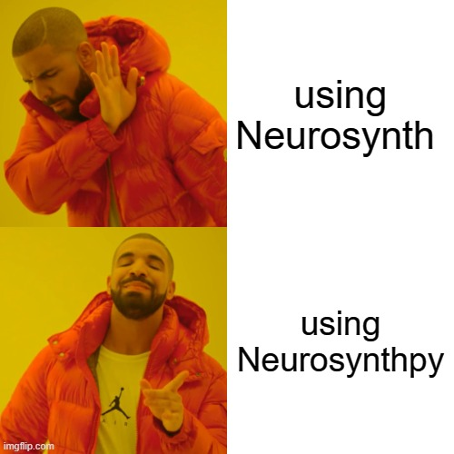

# Neurosynth_autofeed

  

Automatically query neurosynth via python with Neurosynthpy

  

## Table of Contents

  

- [Project Overview](#project-overview)
- [Dependencies](#installation)
- [Usage](#usage)
- [Features](#features)
- [Limitations](#limitations)
- [Contact](#contact)

  

## Project Overview

  

Neurosynth (https://neurosynth.org/) is a powerful web-based platform that analyzes neuroimaging studies to extract statistical associations between cognitive functions and brain regions. However, the process of inputting specific coordinates into Neurosynth can be time-consuming, especially when dealing with a large number of regions. To address this challenge, we propose developing a Python function that automates the process of feeding coordinates from Nifti files to Neurosynth, providing researchers with efficient access to relevant data about their regions of interest (ROIs).

  

The automated function can have various applications in the field of cognitive neuroscience. Researchers can use it to quickly gather information about specific brain regions, such as studies that have investigated those regions and the associations found within those studies. This can aid in generating hypotheses, guiding experimental design, and gaining a comprehensive understanding of the existing literature on a particular topic. The function can also be useful in large-scale analyses where a vast number of ROIs need to be explored, saving significant time and effort.

  

## Dependencies

  

Dependencies that you'll need to set up before running our project:

- numpy

- nilearn

- nibabel

- matplotlib

- pandas

  

## Usage

  

After installation you can use `api.get` to quary your coordinates.

Specifiy `associations` or `studies` to get the information you want.

  

    from neurosynthpy import api, plotting
    
    associations = api.get(np.array([[-10,-10,-10], [0,0,0], [10,10,10]]), 'associations')
    studies = api.get(np.array([[-10,-10,-10], [0,0,0], [10,10,10]]), 'studies')
      

Next follow this code to plot and visualize the data extracted:

  

    from neurosynthpy import plotting
    
    plotting.plot_by_target(df, df.groupby('Study').count().sort_values('x, y, z')['x, y, z'].index[-1], 'Study')

  
## Functions

**Query:**
| Function | Header 2 |
| -------- | -------- | 
| Row 1,   | Data     |
| Row 2    |          |
| Row 3    |          |

**Plots:**
| Function | Explanation |
| -------- | -------- | 
| plot_association_hist(associated_regions_list: list z_scores_list: list, threshold: float = 0.05) -> plt Figure   | A function that plots a histogram of the associated regions and functions based on the z-scores of the associations.    |
| plot_by_target(df: pd.DataFrame, target: str, col_name: str)  |     A function that receives VOIs of a target association/paper and plots the relevant VOIs.     |
| plot_anatomical_voi(voi_coords: np.ndarray) -> Any   |    Plot the coordinates on an MNI glass brain.      |

## Features

  

-  **Validator**: validation of the input coordinates.

-  **Querier**: quary the coordinates for the associations and studies data.

-  **Parser**: parse json data to panda DataFrames.

-  **Ploter**: Create different plots of the data extracted.

## Limitations

Right now our beta version doesn't support very large datasets (for querying multiple voxels) in oder to reduce number of http requests on the server so we don't recommand using the package for more than 1000 coordinates but stayed tuned!

## Contact

  

If you want to reach us for any questions or collaborations related to the project, talk to us!

  

- idangrosbard@mail.tau.ac.il (idg7, idangrosberg)

- yohayzvi@gmail.com (YohayZvi)

- yuvalnavon@mail.tau.ac.il (YuvNavon)

- orrachels@mail.tau.ac.il (ORachelS)

